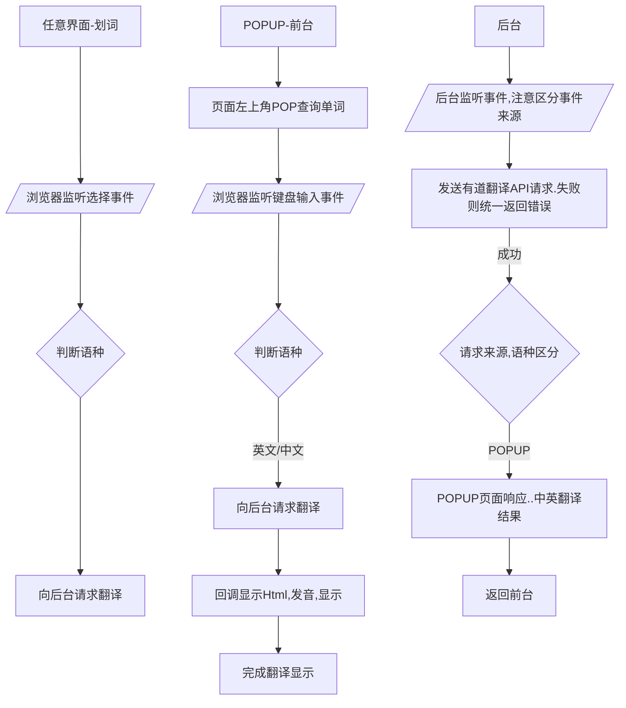

## 快速开始

简单的字典查询.

参考 https://mermaid-js.github.io/mermaid/#/./flowchart?id=a-node-in-a-subroutine-shape

## 程序执行流程图
整体程序执行流程图如下..

```mermaid!
flowchart TD

OneA[任意界面-划词] ---> OneB[/浏览器监听选择事件/] --> OneC{判断语种} ---> OneD[向后台请求翻译]


TwoA[POPUP-前台] --> TwoB[页面左上角POP查询单词] -->  TwoC[/浏览器监听键盘输入事件/] --> TwoD{判断语种} -- 英文/中文 --> TwoE[向后台请求翻译] --> TwoF[回调显示Html,发音,显示] --> TwoG[完成翻译显示]


ThreeA[后台] --> ThreeB[/后台监听事件,注意区分事件来源/]  --> ThreeC[发送有道翻译API请求.失败则统一返回错误] -- 成功 --> ThreeD{请求来源,语种区分} -- POPUP --> ThreeE[POPUP页面响应..中英翻译结果] --> ThreeF[返回前台]

```

